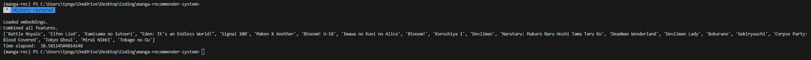

# Manga Recommender System

## Motivation
I am an avid manga reader who struggles to find niche manga picks relating to my favorite titles. I wanted to create this recommender to recommend me titles I have never seen or heard of before which will hopefully expand my horizon in the manga reading world!

## Project Description
This project is a content-based recommender system for manga, leveraging metadata and user preferences to provide personalized recommendations.

Dataset: https://www.kaggle.com/datasets/andreuvallhernndez/myanimelist?resource=download&select=manga.csv (last updated August 7th, 2023)

## Installation
1. Clone the repository:
   ```sh
   git clone https://github.com/yourusername/manga-recommender-system.git
   ```

## How to Run
1. Download the kaggle dataset and place it in data/raw/
2. 
- If you're on Windows, run ```notebooks/get_synopsis_embeddings.ipynb``` to get embeddings
- If you're on Mac, run ```python macbook.py``` to get embeddings

3. Fill null ratings by running ```notebooks/fill_null_ratings.ipynb```
4. You can then call ```python main.py``` to get recommendations if you change the ```TITLE``` variable

## Content Based Recommendations

### Attributes
These are attributes that I felt would help recommend another manga to another person

Title
- type : this can be of type Manga, Manhwa, etc
- score : current MAL score
- rank : overall current rank
- popularity : popularity of the manga
- synopsis : summary of the manga series
- author : list of authors
- genres : list of genres
- themes : list of themes
- demographics : list of demographics (seinen, shounen)

### Approach
I wanted to perform EDA to understand my data while also getting rid of unwanted features. I then wanted to normalize, get rid of nulls and fill in scores.

To fill in null scores, I would use KNN to determine and predict scores as I believed that manga with similar synopsis score similarily. I noticed lots of the top manga have similar themes, so that played in a role in me choosing to use KNN to determine null scores.

I also wanted to use embeddings to get models to understand the semantic meaning of synopsis when recommending similar manga of the user's choosing.

Lastly, I wanted to use content based recommendations as a way to recommend manga to my users. I don't have other user data, so we are reliant on the features that I listed above to help recommend manga to others.

### Screenshots

Manga recommending based on the title "Gantz" ... This is my all time favorite manga series
